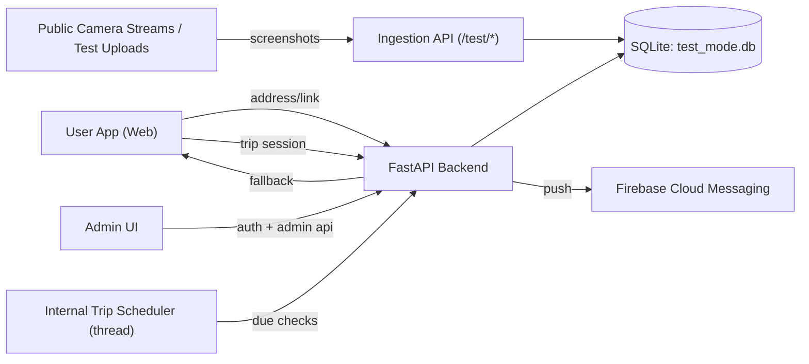

# Техническое задание (ТЗ) v1.2

## Проект

Сервис оценки свободных парковочных мест по адресу на основе анализа скриншотов с публичных камер.

## Версия документа

- Версия: `1.2`
- Статус: `MVP In Progress`
- Дата обновления: `2026-03-25`
- Регион запуска: `Россия`

---

## 1. Цель и продуктовая гипотеза

### 1.1 Цель MVP

Дать пользователю быстрый ответ на вопрос: «Есть ли свободные места в радиусе до 1 км от нужного адреса?» без показа видео/фото в интерфейсе.

### 1.2 Что видит пользователь

- ввод адреса или ссылки из карт;
- итоговое количество свободных мест;
- распределение по классам машин `A/B/C/D/PICKUP`;
- расстояния до источников данных;
- опционально: мониторинг изменений во время поездки.

### 1.3 Что не видит пользователь

- живой видеопоток;
- скриншоты с камер;
- внутренние технические метрики.

---

## 2. Границы MVP

### 2.1 Входит в MVP

- Тестовый контур загрузки скриншотов (`/test/screenshots`, `/test/batch-screenshots`).
- Поиск парковки по координатам и адресам.
- Админ-кабинет с авторизацией (email/password).
- Встроенная защита от brute-force и базового DDoS.
- Trip Monitoring:
  - сессия поездки;
  - планирование проверок по ETA;
  - автообработка due-check через внутренний scheduler;
  - push через FCM + fallback pull.

### 2.2 Не входит в MVP

- Прямая интеграция с RTSP-потоками всех городских камер.
- Гарантированная ETA маршрутизация через Maps API (в текущем MVP ETA задается клиентом).
- Биллинг и подписки.
- Полноценные мобильные SDK для APNs/FCM в production-grade исполнении.

---

## 3. Архитектура MVP

### 3.1 Логическая схема

### 3.2 Компоненты

- `Сервис сбора (ingestion)`: принимает скриншоты, фиксирует статус камеры.
- `Сервис распознавания`: в тестовом режиме — эвристика/ручной ввод `free_*`.
- `Хранилище`: SQLite (`test_cameras`, `test_snapshots`, `trip_*`, `auth_*`).
- `API`: user/admin/auth/trip endpoints.
- `Scheduler`: встроенный поток в backend (без внешнего cron).
- `Push`: FCM legacy HTTP API (при наличии `PUSH_PROVIDER=fcm` и `FCM_SERVER_KEY`).

### 3.3 Почему встроенный scheduler

- упрощает MVP-эксплуатацию;
- убирает зависимость от внешнего cron в пилоте;
- позволяет мгновенно обрабатывать due-checks в одном процессе.

---

## 4. Функциональные требования

### 4.1 Поиск парковки

- Пользователь вводит адрес или ссылку.
- Система получает координаты (`/geo/resolve` для адреса).
- Система возвращает агрегированную доступность в радиусе до 1000 м.

### 4.2 Работа с камерами

- Система хранит реестр камер.
- Для каждой камеры фиксируется последний статус захвата:
  - `ok`
  - `camera_unreachable`
  - `unknown`

### 4.3 Trip monitoring

- Клиент создает `trip_session`.
- Backend рассчитывает график проверок (`half ETA`, `pre-arrival`, `fallback +15m`).
- Scheduler запускает due-check автоматически.
- При существенном изменении backend создает notification.
- При доступном push отправляет уведомление в FCM.
- При недоступном push — fallback через `notifications/pull`.

### 4.4 Админ-кабинет

- Статистика запросов пользователей.
- Статистика зон «мест много/мало».
- Список камер и статус получения скриншотов.
- Ручное добавление камеры.

### 4.5 Авторизация администратора

- Login по email/password.
- `HttpOnly` session cookie.
- Forgot/reset password.
- Опциональная Google reCAPTCHA.

---

## 5. Нефункциональные требования

### 5.1 Производительность

- Цель для MVP: p95 поиска <= 2 сек при пилотной нагрузке.

### 5.2 Актуальность

- Целевая частота обновления данных: 1 раз в минуту (поточная реализация).
- В test mode актуальность зависит от частоты ручной загрузки скриншотов.

### 5.3 Надежность

- Частичная недоступность камер не ломает ответ, используется доступный subset.
- Сессии поездок автоматически закрываются как `completed`, `expired` или `cancelled`.

### 5.4 Безопасность

- Rate-limits на API.
- Ограничение попыток входа и восстановления пароля.
- PBKDF2-хеширование паролей.
- Security headers на все HTTP-ответы.

---

## 6. Модель данных (реализованный MVP)

### 6.1 Камеры и снимки

- `test_cameras`
- `test_snapshots`
- `user_requests`

### 6.2 Мониторинг поездки

- `trip_sessions`
- `trip_checks`
- `trip_notifications`

### 6.3 Админ и безопасность

- `admin_users`
- `admin_sessions`
- `password_reset_tokens`

Подробные API-контракты и поля: `/Users/dmitrybalaushko/Codex/Parking/docs/runbooks/TRIP_MONITORING_API.md`

---

## 7. API-контур MVP

### 7.1 User API

- `POST /geo/resolve`
- `GET /parking/search`
- `POST /trip-monitoring/sessions`
- `GET /trip-monitoring/sessions/{trip_session_id}`
- `POST /trip-monitoring/sessions/{trip_session_id}/cancel`
- `GET /trip-monitoring/notifications/pull`
- `POST /trip-monitoring/notifications/read`

### 7.2 Test-mode ingestion API

- `GET /test/cameras`
- `POST /test/screenshots`
- `POST /test/batch-screenshots`

### 7.3 Admin API

- `GET /admin/stats/requests`
- `GET /admin/stats/availability`
- `GET /admin/cameras`
- `POST /admin/cameras`
- `POST /admin/cameras/{camera_id}/status`
- `POST /trip-monitoring/runner/check-due` (manual диагностический запуск)

### 7.4 Auth API

- `GET /auth/captcha-config`
- `POST /auth/bootstrap-admin`
- `POST /auth/login`
- `POST /auth/logout`
- `GET /auth/me`
- `POST /auth/forgot-password`
- `POST /auth/reset-password`

---

## 8. Roadmap

### Этап 1 (текущий MVP)

- Test-mode ingestion.
- Базовый user UI (RU/ENG).
- Admin UI + auth.
- Trip monitoring + internal scheduler + FCM fallback architecture.

### Этап 2 (Pilot Production)

- Интеграция с реальными потоками камер.
- Более точный CV/ML пайплайн (детекция авто + парковочных промежутков).
- Геосервис ETA от Maps API (Google/OSM/Yandex) для авторасчета check schedule.
- Продовый push-стек (FCM/APNs) с device-token lifecycle.

### Этап 3 (Scale)

- Вынос scheduler в отдельный worker.
- Очереди задач (RabbitMQ/Kafka/Redis streams).
- Хранилище уровня Postgres + аналитические витрины.
- SLA/SLO, алерты, on-call процессы.

---

## 9. Риски и mitigation

### Риск 1: нестабильные камеры

- Меры: кэш последних валидных данных, статус камеры, деградация ответа.

### Риск 2: ложные ожидания пользователя при поездке

- Меры: trip monitoring, push/pull updates, указание времени обновления.

### Риск 3: атаки на auth

- Меры: rate-limit, lockout, captcha, session TTL, безопасный reset flow.

### Риск 4: юридические ограничения (РФ)

- Меры: whitelist источников, legal review по каждому источнику, отказ от показа первичных кадров в клиенте.

---

## 10. Чек-листы

### 10.1 Product / Legal

- [ ] Подтверждены права на использование источников камер.
- [ ] Зафиксирован список разрешенных источников.
- [ ] Подготовлены пользовательские дисклеймеры точности.

### 10.2 Backend

- [ ] Работают `/parking/search`, `/geo/resolve`, `/health`.
- [ ] Работают `trip-monitoring` endpoint'ы.
- [ ] Включен internal scheduler.
- [ ] Настроены push env-переменные (если нужен real push).

### 10.3 Security

- [ ] Bootstrap admin выполнен и временный пароль заменен.
- [ ] `AUTH_COOKIE_SECURE=true` в проде.
- [ ] `AUTH_DEBUG_RETURN_RESET_TOKEN=false` в проде.
- [ ] Настроены `DDOS_MAX_REQUESTS_PER_MINUTE` и auth-rate-limits.
- [ ] Подключена reCAPTCHA (при интернет-доступе).

### 10.4 Frontend

- [ ] Работает RU/ENG переключение.
- [ ] Поиск по адресу и ссылке работает.
- [ ] Trip monitoring запускается после поиска.
- [ ] Отображаются изменения доступности.

### 10.5 Operations

- [ ] Мониторятся ошибки scheduler/push/auth.
- [ ] Есть процедура ручного запуска due-check (`/trip-monitoring/runner/check-due`).
- [ ] Документация синхронизирована с кодом.
